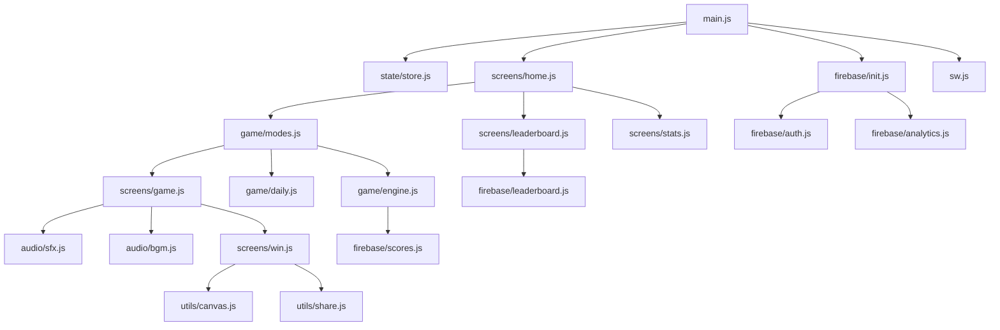

# Architecture — Beat Me in 3

## System Design

```
┌─────────────────────────────────────────────────────────────┐
│                        Client (Browser)                      │
│                                                             │
│  ┌──────────┐  ┌──────────┐  ┌──────────┐  ┌───────────┐  │
│  │  screens/│  │  game/   │  │  audio/  │  │  firebase/│  │
│  │  UI layer│  │  engine  │  │  engine  │  │  client   │  │
│  └────┬─────┘  └────┬─────┘  └──────────┘  └─────┬─────┘  │
│       │             │                              │        │
│       └──────┬──────┘                             │        │
│              │                                    │        │
│         ┌────▼─────┐                    ┌─────────▼──────┐ │
│         │  state/  │                    │ Firebase SDK   │ │
│         │  store   │                    │ (Firestore +   │ │
│         └──────────┘                    │  Auth +        │ │
│                                         │  Analytics)    │ │
│  ┌──────────────────────────────────┐   └────────────────┘ │
│  │         Service Worker           │                      │
│  │  (cache / offline / notifs)      │                      │
│  └──────────────────────────────────┘                      │
└─────────────────────────────────────────────────────────────┘
                              │
                    ┌─────────▼──────────┐
                    │   Firebase Cloud   │
                    │                   │
                    │  ┌─────────────┐  │
                    │  │  Firestore  │  │
                    │  │  (scores,   │  │
                    │  │   wins)     │  │
                    │  └─────────────┘  │
                    │  ┌─────────────┐  │
                    │  │  Firebase   │  │
                    │  │  Auth       │  │
                    │  └─────────────┘  │
                    │  ┌─────────────┐  │
                    │  │  Analytics  │  │
                    │  └─────────────┘  │
                    └───────────────────┘
```

## Module Map

```
src/
├── main.js                  — app bootstrap, router, SW registration
├── state/
│   └── store.js             — reactive state management (localStorage-backed)
├── game/
│   ├── engine.js            — core guess logic, timer, scoring
│   ├── daily.js             — daily challenge seed, match tracking
│   ├── modes.js             — quick/friend/daily mode orchestration
│   └── hints.js             — hint validation and purchase gates
├── screens/
│   ├── home.js              — home screen rendering and events
│   ├── game.js              — gameplay screen (numpad, attempts, feedback)
│   ├── win.js               — win/lose screen, confetti, result card
│   ├── stats.js             — personal stats modal
│   ├── leaderboard.js       — leaderboard screen (today + all-time)
│   ├── settings.js          — sound, theme, notifications settings
│   └── onboarding.js        — first-run tutorial flow
├── audio/
│   ├── engine.js            — Web Audio context, tone synthesizer
│   ├── sfx.js               — named SFX functions (click, win, lose, etc.)
│   └── bgm.js               — background music sequencer
├── firebase/
│   ├── init.js              — Firebase app + services initialization
│   ├── auth.js              — anonymous auth + username management
│   ├── scores.js            — daily score read/write
│   ├── leaderboard.js       — leaderboard queries
│   └── analytics.js         — event tracking helpers
├── utils/
│   ├── date.js              — date key helpers, timezone handling
│   ├── canvas.js            — result card rendering (html2canvas)
│   ├── share.js             — native share / clipboard fallback
│   ├── challenge.js         — friend challenge URL encode/decode
│   └── geolocation.js       — country flag lookup
└── sw.js                    — Service Worker (offline, notifications)
```

## Data Flow

### Daily Challenge Flow
```
Home screen
  → ensureAuth() [Firebase Anonymous Auth]
  → checkDailyState() [localStorage: date, matchCount, score]
  → startDailyChallenge()
      → getDailySecretNumber() [deterministic seed: date + matchIndex]
      → initGameScreen()
          → startCountdown(3,2,1,Go)
              → startTimer(15s)
                  → User selects digit → submitGuess()
                      → [correct] → stopTimer → showWin → submitScore (Firestore)
                      → [wrong]   → decrementAttempts → showHint → continueOrLose
```

### Leaderboard Sync Flow
```
openLeaderboard()
  → Firestore query: scores where date == today, orderBy(totalTries ASC, totalTime ASC)
  → Render top 10 + user rank
  → Real-time listener updates on new scores
```

### Friend Challenge Flow
```
Challenger: pickNumber(0-9)
  → makeChallengeUrl(num): base64(num + timestamp)
  → shareLink (native share or clipboard)

Recipient: taps link (?c=ENCODED)
  → decodeChallengeUrl(c)
  → validate timestamp (< 24h)
  → launchGame(secretNumber)
  → on win: challengeBack() — generate reverse link
```

## State Model

### localStorage (persistent)
```
bmi3_uid                   — Firebase anonymous UID
bmi3_username              — display name
bmi3_streak                — current daily streak
bmi3_best_streak           — all-time best streak
bmi3_last_played           — date string of last daily play
bmi3_stats                 — JSON: { played, wins, totalTries, bestTime, dist }
bmi3_daily_score           — JSON: today's match state
bmi3_hints_owned           — integer: owned hint count
bmi3_onboarded             — bool: has seen tutorial
bmi3_sound_enabled         — bool
bmi3_numpad_theme          — 'default'|'fire'|'purple'|'gold'
bmi3_flag                  — country flag emoji
```

### Firestore Schema
```
scores/{YYYY-M-DD_UID}
  uid: string
  name: string
  totalTries: number
  totalTime: number (ms)
  matchesPlayed: number
  matchesWon: number
  date: string
  timestamp: Timestamp
  flag: string

wins_quick/{UID}
  uid: string
  name: string
  wins: number
  flag: string
  timestamp: Timestamp

wins_friend/{UID}
  uid: string
  name: string
  wins: number
  flag: string
  timestamp: Timestamp
```

## Component Map (Mermaid)



## Security Model

- **Firebase Security Rules** enforce document ownership via UID
- **Rate limiting** via Cloud Firestore rules (max 1 write/minute per UID for daily scores)
- **Username squatting** prevented by UID-keyed documents (display name is cosmetic only)
- **Challenge links** include timestamp to prevent replay attacks (24h TTL)
- **No server secrets** in client code — all Firebase keys are public (restricted by domain in Firebase Console)

## Performance Targets

| Metric | Target |
|---|---|
| Lighthouse Performance | ≥ 90 |
| First Contentful Paint | < 1.5s |
| Time to Interactive | < 2.5s |
| JS Bundle Size | < 50KB gzipped |
| Offline Capable | Yes (cache-first SW) |
| 60fps animations | Yes (CSS transforms only) |
